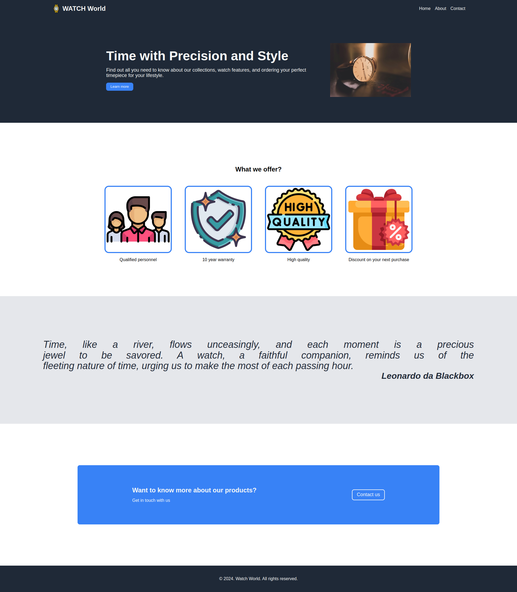

# Landing Page
A simple landing page built as part of The Odin Project's Foundations course.

## Features

- A clean and responsive design
- A hero section with a background image and call-to-action button
- A features section with icons and brief descriptions
- A testimonials section with quotes and images
- A call-to-action section with a button and background image

## Demo

[**Live Demo**](https://radix-ratio.github.io/landing-page-project/) | [**Project Specs**](https://www.theodinproject.com/lessons/foundations-landing-page) 

## Screenshots

## Technologies Used

- HTML5
- CSS3
- Flexbox for layout

## Getting Started

1. Clone the repository: `git clone https://github.com/your-github-username/landing-page.git`
2. Open the project in your favorite code editor
3. Make changes to the HTML and CSS files as desired
4. Open the `index.html` file in a web browser to view the page

## License

This project is licensed under the MIT License. See [`LICENSE`](https://choosealicense.com/licenses/mit/)  for details.

## Acknowledgments

- The Odin Project for providing the curriculum and resources
- Unsplash for providing the background images
- Flaticon for providing the icon images

## Authors

- [@radix-ratio](https://www.github.com/radix-ratio)

